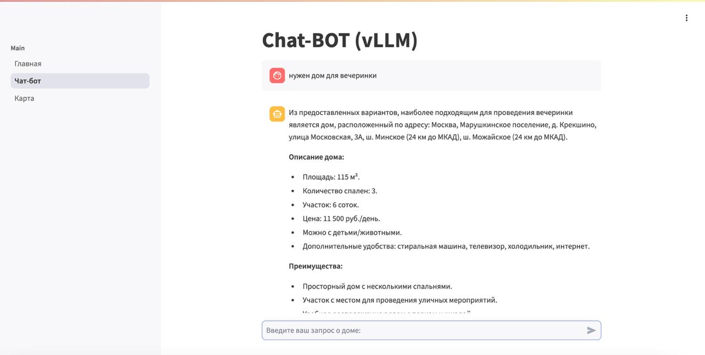
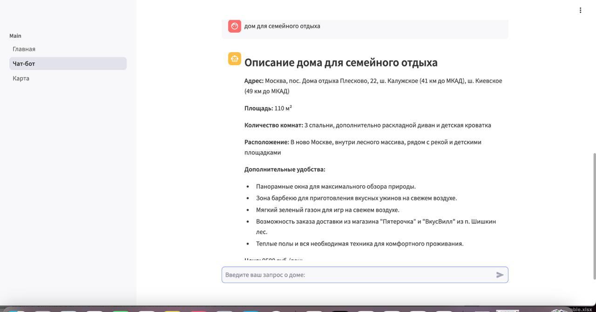
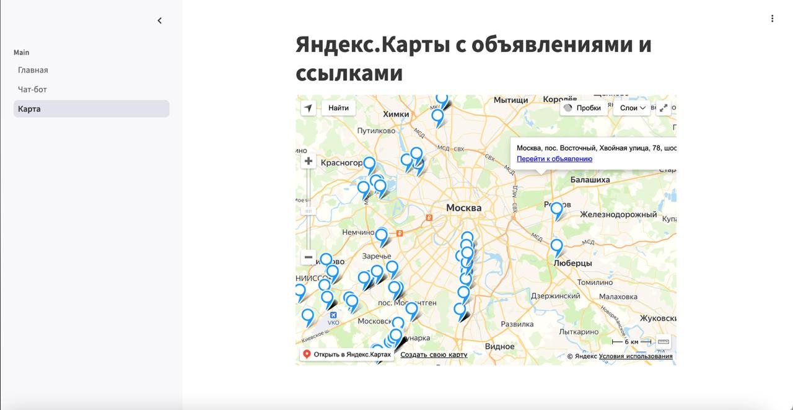

# Проект по Продвинутым Методам Машинного Обучения


<p align="center">
       <br/>
     <H2 align="center">Риелторский стартап</H2> 
</p>

<a target="_blank" href="https://cookiecutter-data-science.drivendata.org/">
    
</a>

Бедные орги каждый год долго-долго выбирают дома на посвят( Мы решили, что так больше продолжаться не может: ~~отменяем посвят~~ делаем супер-пупер RAG систему с возможностью быстрого и удобного подбора релевантных объявлений! Как говорится «Лофты размыли ценность посвята», пора решать эту проблему! 

Проект посвящён обработке данных по объявлениям аренды загородных домов с платформы ЦИАН. Как говорится, начинали с простого анализа, а закончили риелторским стартапом.

*1. Загрузите репозиторий на свой компьютер и откройте её в вашей предпочитаемой среде разработки (IDE).* 
```python
git clone https://github.com/Y1OV/rag4rent.git
```
*2. Откройте терминал в IDE и установите все библиотеки:* 

```python
pip install -r requirements.txt
```
*3. Дождитесь установки, а затем введите следующую команду:*

```python
cd rag4rent/src/streamlit
```
*4. Запустите сервер vLLM:*

```python

vllm serve ai-sage/GigaChat -20B-A3B-instruct
 --disable-log-requests
 --trust_remote_code 
 --dtype bfloat16
 --max-seq-len 20000
 --tensor -parallel -size 2

```

*5. Запустите приложение:*

```python
streamlit run streamlit_app.py
```

# Пример работы web-сервиса

***Часть 1:***

<p align="center">
      <br/>
</p>

***Часть 2:***

<p align="center">
      <br/>
</p>

***Часть 3:***

<p align="center">
      <br/>
</p>


## Project Organization

```
├── LICENSE            <- Open-source license if one is chosen
├── Makefile           <- Makefile with convenience commands like `make data` or `make train`
├── README.md          <- The top-level README for developers using this project.
├── data               <- Our Data.
│
├── docs               <- A default mkdocs project; see www.mkdocs.org for details
│
├── notebooks          <- Jupyter notebooks. Naming convention is a number (for ordering),
│                         the creator's initials, and a short `-` delimited description, e.g.
│                         `1.0-jqp-initial-data-exploration`.
│
├── pyproject.toml     <- Project configuration file with package metadata for 
│                         RAG4Rent and configuration for tools like black
│
├── parser         <- Cian parser.
│
│
├── requirements.txt   <- The requirements file for reproducing the analysis environment, e.g.
│                         generated with `pip freeze > requirements.txt`
│
├── setup.cfg          <- Configuration file for flake8
│
└── src   <- Source code for use in this project.
    │
    └── streamlit                
       └── streamlit_app.py    <- Main code runner

```

--------

